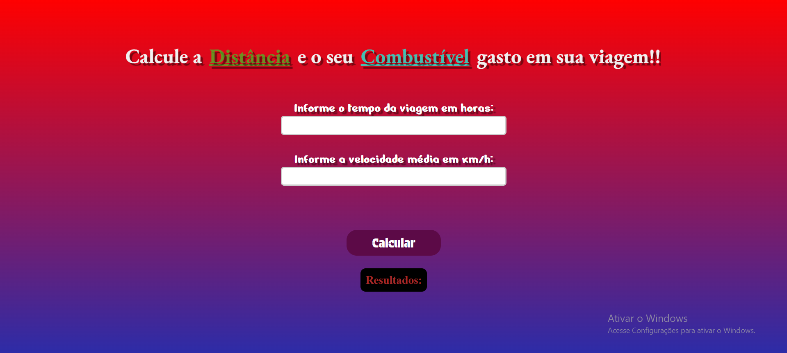
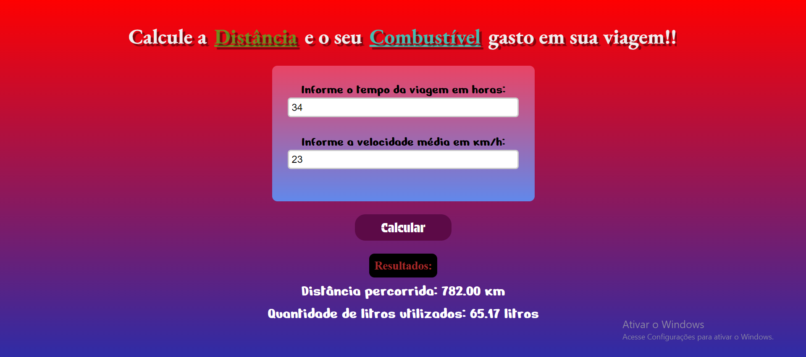
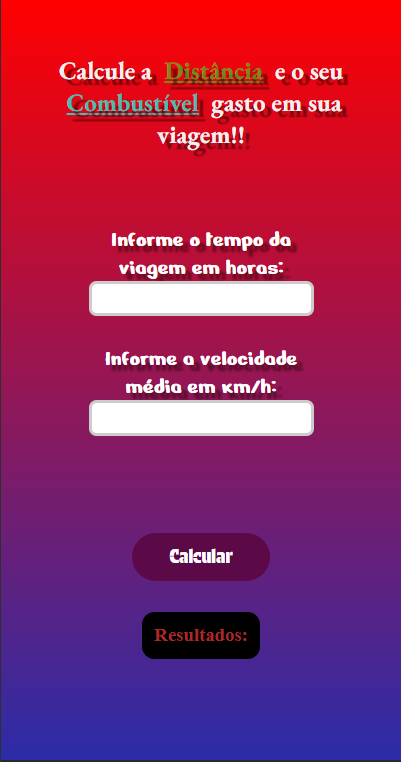

# PROJETO PESSOAL 🚀

## PROJETO CRIADO PARA CALCULAR OS LITROS DE COMBUSTÍVEL GASTOS EM UMA VIAGEM!!
## O CÁLCULO TEM COMO BASE QUE O CARRO FAZ 12KM COM UM LITRO👍

[]

[]

## MOBILE

[]

[]

### Projeto feito para aplicar meus estudos emm Javascrip,HTML5 e CSS3.

### Estou muito satisfeito com o resultado, cada vez mais evoluindo 